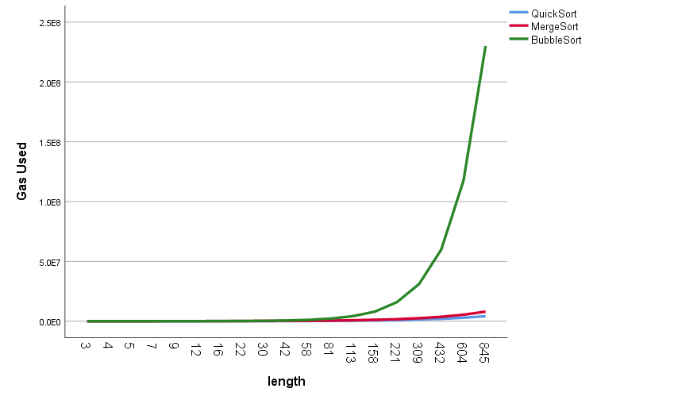
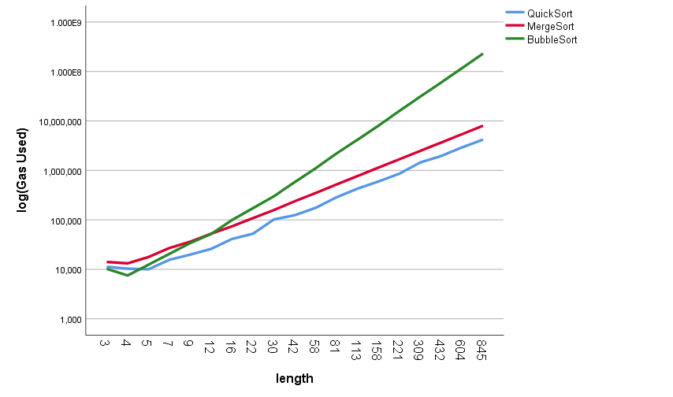

<div align="center">

# Decentralized Online Judge

</div>

# Introduction

**Decentralized Online Judge** provides a pioneering solution for establishing a decentralized provable online judging platform for competitive programming.

Our primary objective is to ensure the transparency and justice of programming contests, attract more OIers/ACMers to participate in web3 and improve the efficiency of blockchain networks through more extensive application of algorithms and data structures.

# How to Use

This project is developed based on Foundry, which is an incredibly easy-to-use smart contract development kit.

If you haven't install foundry, you can run

```bash
foundryup
```

After the installation, you can run 

```bash
foundry install qpdk777/DOJ --no-commit
forge init
```

Then open `foundry.toml` in the root folder of your project, insert the code below and save

```toml
remappings = [
    '@qpdk777/DOJ=lib/DOJ/src',
]
```

Now you can create your smart contract problems in `./src` .

To create a problem, you need to:

* write the content of you problem and encode it with `base64` to generate an URI
* inherit `SolutionInterface` interface, which defines the functions that an solution contract must implement
* inherit `Judge` contract and override `judge()` function, in which you can test whether a solution is right or wrong
* write a script to deploy everything, where you can set the `testCaseNumber`, `gasLimit` and other parameters.

To provide a solution, you need to:

* implement the `SolutionInterface` of that problem
* design and implement an excellent algorithm to solve this problem
* write a script to deploy your solution 
* call `enterJudge` with the address of your solution and get the result of the judge

# Example

For Quick Sort problem, I write three solutions - quick sort, merge sort and bubble sort, whose time complexities are $O(n\log n)$, $O(n\log n)$ and $O(n^2)$ respectively.

Here comes their gas usage comparison. As the scale of the array grows, their performances become extremely distinct.

|            Gas Usage in linear                  |     Gas Usage in logarithm        |
|:-----------------------------------------------:|:---------------------------------:|
|||

The gas usage of quick sort and merge sort, which are of the same time complexity, grows together slowly, while that of bubble sort pumps up rapidly.

This proves that we can use the time complexity to distinguish which one is a better solution. It also allows some linear spare time to avoid unexpected and unpleasant TLE (GLE in DOJ, which means Gas Limit Exceeded).